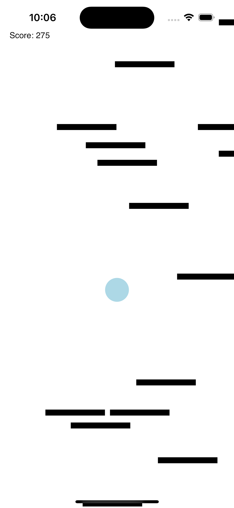

# Doodle jump-like game in React Native

This is a simple game inspired by Doodle Jump, built with React Native. Still WIP but basic functionality is there.

## To do

- [x] Randomly generated platforms
- [x] Basic physics (jumping, gravity)
- [x] Score counter
- [ ] Die when falling off the screen
- [ ] Game over
- [ ] Better random generation of platforms (prevent impossible jumps when platforms are too far apart)
- [ ] High score
- [ ] Use textures instead of simple shapes
- [ ] Add more features (powerups, enemies, etc.)
- [ ] Basic menu
- [ ] Background
- [ ] Sound effects

## Demo of current state

[Watch the demo in video](https://github.com/Nodonisko/doodle-jump/raw/main/demo.mp4)

## How to run

1. `npm install`
2. `npx expo prebuild`
3. `npm run ios` or `npm run android`
